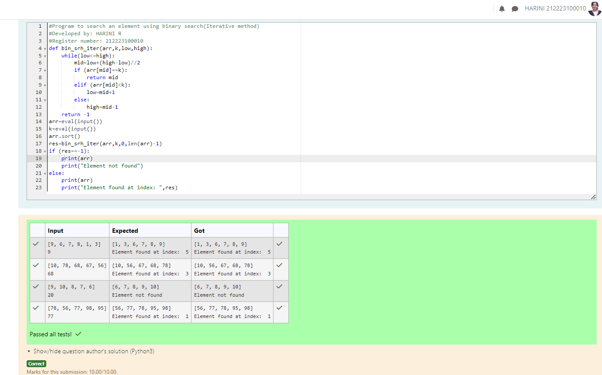
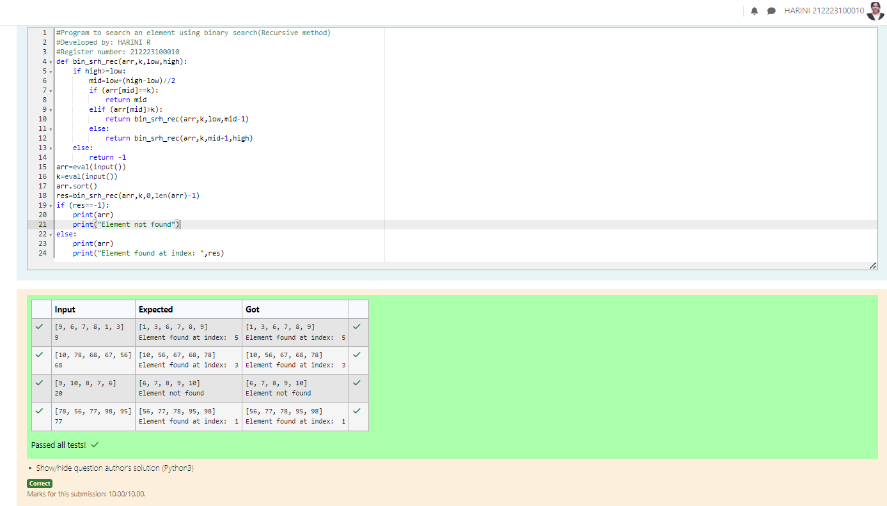

# EX07 Linear Search and Binary search
## Aim:
To write a program to perform linear search and binary search using python programming.
## Equipment’s required:
1.	Hardware – PCs
2.	Anaconda – Python 3.7 Installation / Moodle-Code Runner
## Algorithm:
## Linear Search:
1.	Start from the leftmost element of array[] and compare k with each element of array[] one by one.
2.	If k matches with an element in array[] , return the index.
3.	If k doesn’t match with any of elements in array[], return -1 or element not found.
## Binary Search:
1.	Set two pointers low and high at the lowest and the highest positions respectively.
2.	Find the middle element mid of the array ie. arr[(low + high)/2]
3.	If x == mid, then return mid.Else, compare the element to be searched with m.
4.	If x > mid, compare x with the middle element of the elements on the right side of mid. This is done by setting low to low = mid + 1.
5.	Else, compare x with the middle element of the elements on the left side of mid. This is done by setting high to high = mid - 1.
6.	Repeat steps 2 to 5 until low meets high
## Program:
# i) Use a linear search method to match the item in a list.
```
#Program to search an element using linear search
#Developed by: HARINI R
#Register number: 212223100010
def lin_srh(arr,n,k):
    for i in range(0,n):
        if(arr[i]==k):
            return i
    else:
        return -1
arr=eval(input())
k=eval(input())
n=len(arr)
arr.sort()
res=lin_srh(arr,n,k)
if (res==-1):
    print(arr)
    print("Element not found")
else:
    print(arr)
    print("Element found at index: ",res)
```
# ii) Find the element in a list using Binary Search(Iterative Method).
```
#Program to search an element using binary search(Iterative method)
#Developed by: HARINI R
#Register number: 212223100010
def bin_srh_iter(arr,k,low,high):
    while(low<=high):
        mid=low+(high-low)//2
        if (arr[mid]==k):
            return mid
        elif (arr[mid]<k):
            low=mid+1
        else:
            high=mid-1
    return -1
arr=eval(input())
k=eval(input())
arr.sort()
res=bin_srh_iter(arr,k,0,len(arr)-1)
if (res==-1):
    print(arr)
    print("Element not found")
else:
    print(arr)
    print("Element found at index: ",res)
```
# iii) Find the element in a list using Binary Search (recursive Method).
```
#Program to search an element using binary search(Recursive method)
#Developed by: HARINI R
#Register number: 212223100010
def bin_srh_rec(arr,k,low,high):
    if high>=low:
        mid=low+(high-low)//2
        if (arr[mid]==k):
            return mid
        elif (arr[mid]>k):
            return bin_srh_rec(arr,k,low,mid-1)
        else:
            return bin_srh_rec(arr,k,mid+1,high)
    else:
        return -1
arr=eval(input())
k=eval(input())
arr.sort()
res=bin_srh_rec(arr,k,0,len(arr)-1)
if (res==-1):
    print(arr)
    print("Element not found")
else:
    print(arr)
    print("Element found at index: ",res)
```
## Sample Input and Output

# i) Use a linear search method to match the item in a list.


# ii) Find the element in a list using Binary Search(Iterative Method).


# iii) Find the element in a list using Binary Search (recursive Method).



## Result
Thus the linear search and binary search algorithm is implemented using python programming.
